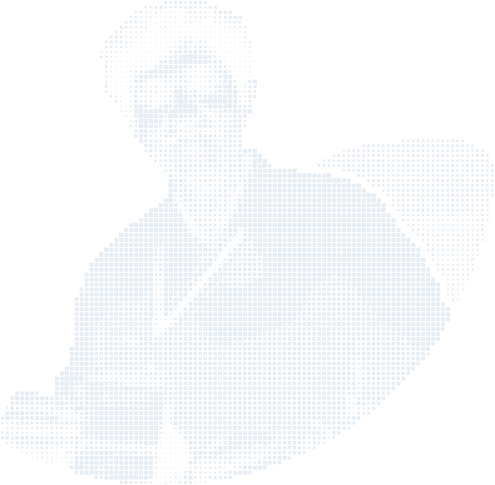

<a href="https://aravinthakshan.com">
  <picture>
    <source media="(prefers-color-scheme: dark)" srcset="assets/portrait-dark.png">
    <source media="(prefers-color-scheme: light)" srcset="assets/portrait-light.png">
    
  </picture>
</a>

### Hi there, I'm A S Aravinthakshan! 👋

Welcome to my GitHub profile! I'm a final-year Computer Science student at MIT, Manipal, with a love for machine learning, software and research.

#### Experience

I'm currently working as a Software Engineer (Contractor) at Paper2Audio, building across Android, iOS, web and browser extensions.

#### Get in touch

Feel free to reach out on [LinkedIn](https://www.linkedin.com/in/aravinthakshan), visit my website at [aravinthakshan.com](https://aravinthakshan.com), or check out more of my work here on [GitHub](https://github.com/aravinthakshan)!
